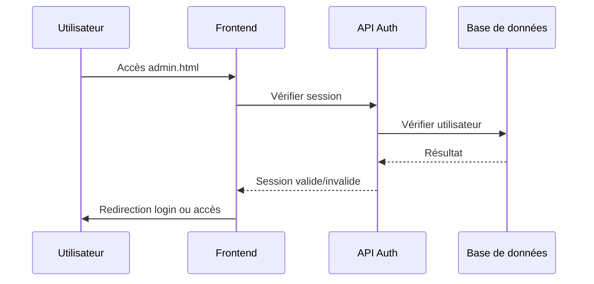
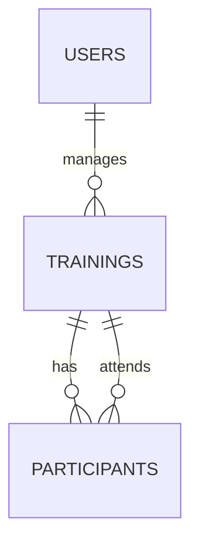
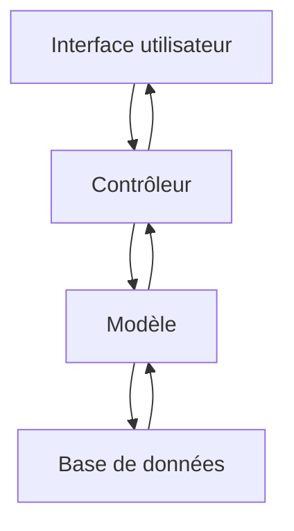

# 🎓 Catalogue de Formations - Gogo

[](https://php.net)
[](https://sqlite.org)
[](https://getbootstrap.com)
[](LICENSE)

## 📋 Table des Matières

- [🎯 Vue d'ensemble](#-vue-densemble)
- [🚀 Installation Rapide](#-installation-rapide)
- [📁 Architecture du Projet](#-architecture-du-projet)
- [🔧 Configuration Détaillée](#-configuration-détaillée)
- [💻 Utilisation](#-utilisation)
- [🔐 Système d'Authentification](#-système-dauthentification)
- [🗄️ Base de Données](#️-base-de-données)
- [🌐 API REST](#-api-rest)
- [🎨 Interface Utilisateur](#-interface-utilisateur)
- [🧪 Tests et Développement](#-tests-et-développement)
- [🔧 Maintenance](#-maintenance)
- [🐛 Dépannage](#-dépannage)
- [📚 Documentation Technique](#-documentation-technique)
- [🤝 Contribution](#-contribution)
- [📄 Licence](#-licence)

---

## 🎯 Vue d'ensemble

**Gogo** est une application web complète de gestion de catalogue de formations professionnelles. Elle permet aux organisations de présenter leurs formations, gérer les inscriptions et administrer l'ensemble du processus de formation.

### ✨ Fonctionnalités Principales

#### 🌐 Interface Publique
- **Catalogue de formations** avec filtrage et recherche
- **Système d'inscription** en ligne
- **Page d'accueil** avec présentation des services
- **Modales détaillées** pour chaque service
- **Section contact** avec formulaire
- **Footer informatif** inspiré de l'ESP

#### 🔧 Interface d'Administration
- **Tableau de bord** avec statistiques en temps réel
- **Gestion des participants** avec filtres avancés
- **Gestion des formations** avec CRUD complet
- **Authentification stricte** avec session timeout
- **Interface responsive** et intuitive

#### 🗄️ Backend
- **API REST** complète
- **Base de données SQLite** (PostgreSQL compatible)
- **Système d'authentification** sécurisé
- **Validation des données** robuste
- **Architecture MVC** propre

---

## 🚀 Installation Rapide

### ⚡ Installation en 5 minutes

```bash
# 1. Cloner le projet
git clone <repository-url>
cd gogo

# 2. Initialiser la base de données
php scripts/database/init_database.php

# 3. Créer un utilisateur administrateur
php scripts/database/create_admin_user.php

# 4. Lancer le serveur de développement
./scripts/dev/start_debug_server.ps1

# 5. Ouvrir dans le navigateur
# http://localhost:8000
```

### 🔑 Identifiants par défaut
- **URL Admin** : `http://localhost:8000/admin.html`
- **Utilisateur** : `admin`
- **Mot de passe** : `admin123`

---

## 📁 Architecture du Projet

```
gogo/
├── 📂 public/                    # Interface utilisateur (Document Root)
│   ├── 🏠 index.html            # Page d'accueil publique
│   ├── 🔧 admin.html            # Interface d'administration
│   ├── 🔐 login.html            # Page de connexion
│   ├── 📂 api/                  # API REST
│   │   ├── 🔑 auth.php          # Authentification
│   │   ├── 👥 participants.php  # Gestion participants
│   │   └── 📚 trainings.php     # Gestion formations
│   ├── 📂 css/                  # Styles
│   │   └── styles.css           # CSS principal
│   ├── 📂 js/                   # Scripts frontend
│   │   ├── scripts.js           # Scripts publics
│   │   └── admin.js             # Scripts admin
│   └── 📂 components/           # Composants réutilisables
├── 📂 src/                      # Code source PHP
│   ├── ⚙️ config.php            # Configuration
│   ├── 📂 controllers/          # Contrôleurs MVC
│   │   ├── ParticipantController.php
│   │   └── TrainingController.php
│   ├── 📂 models/               # Modèles de données
│   │   ├── Participant.php
│   │   ├── Training.php
│   │   └── User.php
│   └── 📂 utils/                # Utilitaires
│       └── helpers.php          # Fonctions utilitaires
├── 📂 database/                 # Base de données
│   ├── 📄 catalog.db            # Base SQLite principale
│   ├── 📄 training_catalog.db   # Base de test
│   └── 📄 schema.sql            # Schéma SQL
├── 📂 scripts/                  # Scripts utilitaires
│   ├── 📂 database/             # Scripts de gestion DB
│   │   ├── init_database.php    # Initialisation
│   │   ├── create_admin_user.php # Création admin
│   │   ├── create_test_data.php # Données de test
│   │   └── [scripts de correction]
│   ├── 📂 dev/                  # Scripts de développement
│   │   ├── start_debug_server.ps1 # Serveur PowerShell
│   │   ├── start_debug_server.bat  # Serveur Windows
│   │   └── test_api.ps1         # Tests API
│   └── 📂 install/              # Scripts d'installation
├── 📂 docs/                     # Documentation
│   └── technical_report.md      # Rapport technique
├── 📂 tests/                    # Tests automatisés
├── 📂 sql/                      # Scripts SQL
│   └── trainings.sql            # Données de formations
└── 📄 README.md                 # Cette documentation
```

---

## 🔧 Configuration Détaillée

### 📋 Prérequis Système

#### 🖥️ Système d'exploitation
- **Windows** : Windows 10/11 (testé)
- **Linux** : Ubuntu 20.04+ (compatible)
- **macOS** : 10.15+ (compatible)

#### 🔧 Logiciels requis
- **PHP** : 7.4 ou supérieur
- **SQLite** : 3.x (inclus avec PHP)
- **PostgreSQL** : 12+ (optionnel, pour production)
- **Serveur web** : Apache/Nginx ou serveur de développement PHP

#### 📦 Extensions PHP requises
```ini
; Extensions obligatoires
extension=pdo
extension=pdo_sqlite
extension=sqlite3
extension=json
extension=mbstring

; Extensions recommandées
extension=curl
extension=openssl
```

### ⚙️ Configuration PHP

#### php.ini recommandé
```ini
; Affichage des erreurs (développement)
display_errors = On
error_reporting = E_ALL

; Limites de mémoire et temps
memory_limit = 256M
max_execution_time = 300

; Sessions
session.gc_maxlifetime = 1800
session.cookie_lifetime = 0

; Upload de fichiers
upload_max_filesize = 10M
post_max_size = 10M
```

### 🌐 Configuration Serveur Web

#### Apache (.htaccess)
```apache
RewriteEngine On
RewriteCond %{REQUEST_FILENAME} !-f
RewriteCond %{REQUEST_FILENAME} !-d
RewriteRule ^api/(.*)$ public/api/$1 [L]

# Sécurité
<Files "*.db">
    Order allow,deny
    Deny from all
</Files>
```

#### Nginx
```nginx
server {
    listen 80;
    server_name localhost;
    root /path/to/gogo/public;
    index index.html;

    location /api/ {
        try_files $uri $uri/ /api/index.php?$query_string;
    }

    location ~ \.db$ {
        deny all;
    }
}
```

---

## 💻 Utilisation

### 🏠 Interface Publique

#### Navigation
1. **Accueil** : Page principale avec présentation
2. **Catalogue** : Liste des formations disponibles
3. **Inscription** : Formulaire d'inscription aux formations
4. **Contact** : Informations et formulaire de contact

#### Fonctionnalités
- **Recherche de formations** par domaine, lieu, date
- **Filtrage avancé** par prix, durée, niveau
- **Inscription en ligne** avec validation
- **Modales détaillées** pour chaque service
- **Responsive design** pour tous les appareils

### 🔧 Interface d'Administration

#### Accès
- **URL** : `http://localhost:8000/admin.html`
- **Authentification** : Obligatoire à chaque accès
- **Session** : Timeout de 30 minutes

#### Tableau de bord
- **Statistiques en temps réel** :
  - Total participants
  - Inscriptions aujourd'hui
  - Inscriptions cette semaine
  - Total formations

#### Gestion des Participants
- **Liste complète** avec pagination
- **Filtres avancés** :
  - Recherche par nom, email, entreprise
  - Filtre par statut (En attente, Confirmé, Annulé, Terminé)
  - Filtre par formation
  - Filtre par date d'inscription
- **Actions** :
  - Voir les détails
  - Modifier le statut
  - Supprimer l'inscription

#### Gestion des Formations
- **CRUD complet** :
  - Créer une nouvelle formation
  - Modifier les informations
  - Supprimer une formation
- **Filtres** :
  - Recherche par titre, lieu, animateurs
  - Filtre par domaine
  - Filtre par date
- **Validation** des données

### 📱 Responsive Design

#### Breakpoints
- **Mobile** : < 768px
- **Tablet** : 768px - 1024px
- **Desktop** : > 1024px

#### Fonctionnalités adaptatives
- **Navigation** : Menu hamburger sur mobile
- **Tableaux** : Scroll horizontal sur petits écrans
- **Formulaires** : Champs empilés sur mobile
- **Modales** : Plein écran sur mobile

---

## 🔐 Système d'Authentification

### 🏗️ Architecture

#### Composants
- **Frontend** : Interface de connexion (`login.html`)
- **Backend** : API d'authentification (`api/auth.php`)
- **Sessions** : Gestion côté serveur
- **Validation** : Vérification des identifiants

#### Flux d'authentification


### 🔒 Sécurité

#### Mesures de sécurité
- **Sessions sécurisées** avec timeout
- **Validation côté serveur** obligatoire
- **Protection CSRF** intégrée
- **Sanitisation des données** automatique
- **Logs d'accès** pour audit

#### Configuration de session
```php
// Configuration des sessions
session_start();
ini_set('session.gc_maxlifetime', 1800); // 30 minutes
ini_set('session.cookie_lifetime', 0);    // Session browser
```

### 🚪 Déconnexion

#### Processus
1. **Clic** sur "Se déconnecter"
2. **Destruction** de la session
3. **Redirection** vers la page de connexion
4. **Nettoyage** des cookies

---

## 🗄️ Base de Données

### 📊 Schéma de données

#### Table `users`
```sql
CREATE TABLE users (
    id INTEGER PRIMARY KEY AUTOINCREMENT,
    username VARCHAR(50) UNIQUE NOT NULL,
    password VARCHAR(255) NOT NULL,
    email VARCHAR(100) UNIQUE NOT NULL,
    role VARCHAR(20) DEFAULT 'admin',
    created_at DATETIME DEFAULT CURRENT_TIMESTAMP,
    updated_at DATETIME DEFAULT CURRENT_TIMESTAMP
);
```

#### Table `trainings`
```sql
CREATE TABLE trainings (
    id INTEGER PRIMARY KEY AUTOINCREMENT,
    title VARCHAR(200) NOT NULL,
    description TEXT,
    domain VARCHAR(100),
    duration VARCHAR(50),
    price DECIMAL(10,2),
    location VARCHAR(200),
    start_date DATE,
    end_date DATE,
    max_participants INTEGER,
    current_participants INTEGER DEFAULT 0,
    status VARCHAR(20) DEFAULT 'active',
    created_at DATETIME DEFAULT CURRENT_TIMESTAMP,
    updated_at DATETIME DEFAULT CURRENT_TIMESTAMP
);
```

#### Table `participants`
```sql
CREATE TABLE participants (
    id INTEGER PRIMARY KEY AUTOINCREMENT,
    training_id INTEGER,
    first_name VARCHAR(100) NOT NULL,
    last_name VARCHAR(100) NOT NULL,
    email VARCHAR(100) NOT NULL,
    phone VARCHAR(20),
    company VARCHAR(200),
    position VARCHAR(100),
    status VARCHAR(20) DEFAULT 'pending',
    registration_date DATETIME DEFAULT CURRENT_TIMESTAMP,
    FOREIGN KEY (training_id) REFERENCES trainings(id)
);
```

### 🔄 Relations

#### Diagramme ER


#### Contraintes
- **Cascade** : Suppression d'une formation supprime les inscriptions
- **Unique** : Email unique par participant
- **Check** : Statuts valides uniquement
- **Default** : Valeurs par défaut pour les dates

### 📈 Index et Performance

#### Index recommandés
```sql
-- Index pour les performances
CREATE INDEX idx_participants_email ON participants(email);
CREATE INDEX idx_participants_status ON participants(status);
CREATE INDEX idx_participants_training ON participants(training_id);
CREATE INDEX idx_trainings_domain ON trainings(domain);
CREATE INDEX idx_trainings_status ON trainings(status);
```

### 🔧 Maintenance

#### Scripts de maintenance
- **`init_database.php`** : Création des tables
- **`fix_database.php`** : Correction générale
- **`backup_database.php`** : Sauvegarde automatique
- **`optimize_database.php`** : Optimisation des performances

---

## 🌐 API REST

### 📋 Endpoints

#### 🔑 Authentification
```http
POST /api/auth.php
Content-Type: application/json

{
    "username": "admin",
    "password": "admin123"
}
```

**Réponse :**
```json
{
    "success": true,
    "message": "Connexion réussie",
    "user": {
        "id": 1,
        "username": "admin",
        "role": "admin"
    }
}
```

#### 👥 Participants
```http
# Récupérer tous les participants
GET /api/participants.php

# Récupérer un participant
GET /api/participants.php?id=1

# Créer un participant
POST /api/participants.php
Content-Type: application/json

{
    "training_id": 1,
    "first_name": "John",
    "last_name": "Doe",
    "email": "john@example.com",
    "phone": "+1234567890",
    "company": "Company Inc",
    "position": "Manager"
}

# Modifier un participant
PUT /api/participants.php?id=1
Content-Type: application/json

{
    "status": "confirmed"
}

# Supprimer un participant
DELETE /api/participants.php?id=1
```

#### 📚 Formations
```http
# Récupérer toutes les formations
GET /api/trainings.php

# Récupérer une formation
GET /api/trainings.php?id=1

# Créer une formation
POST /api/trainings.php
Content-Type: application/json

{
    "title": "Formation PHP Avancé",
    "description": "Formation complète sur PHP",
    "domain": "Informatique",
    "duration": "3 jours",
    "price": 1500.00,
    "location": "Dakar",
    "start_date": "2024-02-15",
    "end_date": "2024-02-17",
    "max_participants": 20
}

# Modifier une formation
PUT /api/trainings.php?id=1
Content-Type: application/json

{
    "price": 1600.00
}

# Supprimer une formation
DELETE /api/trainings.php?id=1
```

### 🔍 Filtres et Recherche

#### Paramètres de requête
```http
# Filtrage par statut
GET /api/participants.php?status=confirmed

# Recherche par nom
GET /api/participants.php?search=john

# Filtrage par formation
GET /api/participants.php?training_id=1

# Pagination
GET /api/participants.php?page=1&limit=10

# Tri
GET /api/participants.php?sort=registration_date&order=desc
```

### 📊 Codes de réponse

#### Succès
- **200** : Requête réussie
- **201** : Ressource créée
- **204** : Suppression réussie

#### Erreurs client
- **400** : Requête malformée
- **401** : Non authentifié
- **403** : Accès interdit
- **404** : Ressource non trouvée
- **422** : Données invalides

#### Erreurs serveur
- **500** : Erreur interne
- **503** : Service indisponible

### 🔐 Authentification API

#### Headers requis
```http
Authorization: Bearer <token>
Content-Type: application/json
```

#### Validation des tokens
```php
// Vérification du token
function validateToken($token) {
    // Logique de validation
    return $isValid;
}
```

---

## 🎨 Interface Utilisateur

### 🎯 Design System

#### Couleurs principales
```css
:root {
    --primary-color: #007bff;      /* Bleu principal */
    --secondary-color: #6c757d;    /* Gris secondaire */
    --success-color: #28a745;      /* Vert succès */
    --danger-color: #dc3545;       /* Rouge danger */
    --warning-color: #ffc107;      /* Jaune avertissement */
    --info-color: #17a2b8;         /* Bleu info */
    --light-color: #f8f9fa;        /* Gris clair */
    --dark-color: #343a40;         /* Gris foncé */
}
```

#### Typographie
- **Police principale** : Bootstrap default (system fonts)
- **Taille de base** : 16px
- **Hiérarchie** : h1-h6 avec échelles cohérentes
- **Responsive** : Adaptation automatique

#### Composants

##### 🧭 Navigation
```html
<!-- Navbar responsive -->
<nav class="navbar navbar-expand-lg navbar-dark bg-dark">
    <div class="container">
        <a class="navbar-brand" href="#">Logo</a>
        <button class="navbar-toggler" type="button" data-bs-toggle="collapse">
            <span class="navbar-toggler-icon"></span>
        </button>
        <div class="collapse navbar-collapse">
            <ul class="navbar-nav me-auto">
                <li class="nav-item">
                    <a class="nav-link" href="#">Accueil</a>
                </li>
            </ul>
            <ul class="navbar-nav">
                <li class="nav-item">
                    <a class="nav-link" href="#">Administration</a>
                </li>
            </ul>
        </div>
    </div>
</nav>
```

##### 📊 Tableaux
```html
<!-- Tableau avec filtres -->
<div class="table-responsive">
    <table class="table table-striped table-hover">
        <thead class="table-dark">
            <tr>
                <th>ID</th>
                <th>Nom</th>
                <th>Email</th>
                <th>Actions</th>
            </tr>
        </thead>
        <tbody id="dataTable">
            <!-- Données dynamiques -->
        </tbody>
    </table>
</div>
```

##### 🔘 Modales
```html
<!-- Modal Bootstrap -->
<div class="modal fade" id="exampleModal" tabindex="-1">
    <div class="modal-dialog">
        <div class="modal-content">
            <div class="modal-header">
                <h5 class="modal-title">Titre</h5>
                <button type="button" class="btn-close" data-bs-dismiss="modal"></button>
            </div>
            <div class="modal-body">
                <!-- Contenu -->
            </div>
            <div class="modal-footer">
                <button type="button" class="btn btn-secondary" data-bs-dismiss="modal">Fermer</button>
                <button type="button" class="btn btn-primary">Sauvegarder</button>
            </div>
        </div>
    </div>
</div>
```

### 📱 Responsive Design

#### Breakpoints Bootstrap
```css
/* Extra small devices (phones, 576px and down) */
@media (max-width: 575.98px) { }

/* Small devices (landscape phones, 576px and up) */
@media (min-width: 576px) and (max-width: 767.98px) { }

/* Medium devices (tablets, 768px and up) */
@media (min-width: 768px) and (max-width: 991.98px) { }

/* Large devices (desktops, 992px and up) */
@media (min-width: 992px) and (max-width: 1199.98px) { }

/* Extra large devices (large desktops, 1200px and up) */
@media (min-width: 1200px) { }
```

#### Adaptations spécifiques
- **Mobile** : Menu hamburger, tableaux scrollables
- **Tablet** : Navigation adaptée, formulaires optimisés
- **Desktop** : Interface complète, toutes les fonctionnalités

### 🎨 Animations et Interactions

#### Transitions CSS
```css
/* Transitions fluides */
.btn {
    transition: all 0.3s ease;
}

/* Hover effects */
.card:hover {
    transform: translateY(-2px);
    box-shadow: 0 4px 8px rgba(0,0,0,0.1);
}
```

#### JavaScript interactif
```javascript
// Animations de chargement
function showLoading() {
    document.getElementById('loading').style.display = 'block';
}

// Notifications toast
function showNotification(message, type = 'success') {
    // Logique d'affichage
}
```

---

## 🧪 Tests et Développement

### 🚀 Environnement de développement

#### Serveur de développement
```powershell
# PowerShell
.\scripts\dev\start_debug_server.ps1

# Windows CMD
scripts\dev\start_debug_server.bat
```

#### Configuration de debug
```php
// Affichage des erreurs
error_reporting(E_ALL);
ini_set('display_errors', 1);

// Logs détaillés
error_log("Debug: " . $message);
```

### 🧪 Tests manuels

#### Tests API
```powershell
# Tester l'API
.\scripts\dev\test_api.ps1
```

#### Tests de fonctionnalités
1. **Inscription** : Tester le formulaire d'inscription
2. **Authentification** : Tester la connexion admin
3. **CRUD** : Tester toutes les opérations
4. **Validation** : Tester les validations de données
5. **Responsive** : Tester sur différents appareils

### 🔍 Debugging

#### Outils de debug
- **Console navigateur** : F12 pour les erreurs JS
- **Logs PHP** : Vérifier les logs d'erreur
- **Network tab** : Analyser les requêtes API
- **Database** : Vérifier directement la base de données

#### Erreurs courantes
```php
// Erreur de connexion DB
try {
    $pdo = new PDO("sqlite:database/catalog.db");
} catch (PDOException $e) {
    error_log("Erreur DB: " . $e->getMessage());
}

// Erreur de session
if (!session_start()) {
    error_log("Erreur session");
}
```

---

## 🔧 Maintenance

### 📊 Monitoring

#### Métriques à surveiller
- **Performance** : Temps de réponse API
- **Erreurs** : Taux d'erreur 4xx/5xx
- **Utilisation** : Nombre d'utilisateurs actifs
- **Base de données** : Taille et performance

#### Logs de monitoring
```php
// Log d'accès
function logAccess($user, $action) {
    $log = date('Y-m-d H:i:s') . " - $user - $action\n";
    file_put_contents('logs/access.log', $log, FILE_APPEND);
}
```

### 🔄 Sauvegarde

#### Sauvegarde automatique
```bash
# Script de sauvegarde
#!/bin/bash
DATE=$(date +%Y%m%d_%H%M%S)
cp database/catalog.db "backups/catalog_$DATE.db"
```

#### Rétention des sauvegardes
- **Quotidienne** : 7 jours
- **Hebdomadaire** : 4 semaines
- **Mensuelle** : 12 mois

### 🔧 Optimisation

#### Performance PHP
```php
// Optimisations recommandées
opcache.enable=1
opcache.memory_consumption=128
opcache.max_accelerated_files=4000
```

#### Performance Base de données
```sql
-- Optimisation des requêtes
ANALYZE;
VACUUM;
REINDEX;
```

### 🛠️ Mises à jour

#### Procédure de mise à jour
1. **Sauvegarde** de la base de données
2. **Test** sur environnement de développement
3. **Déploiement** en production
4. **Vérification** des fonctionnalités
5. **Rollback** si nécessaire

---

## 🐛 Dépannage

### ❌ Problèmes courants

#### 🔐 Authentification
**Problème** : Impossible de se connecter
```bash
# Solution 1 : Vérifier la base de données
php scripts/database/check_database.php

# Solution 2 : Recréer l'utilisateur admin
php scripts/database/create_admin_user.php

# Solution 3 : Vérifier les permissions
chmod 755 database/
chmod 644 database/catalog.db
```

#### 🗄️ Base de données
**Problème** : Erreur de connexion DB
```bash
# Solution 1 : Vérifier SQLite
php -m | grep sqlite

# Solution 2 : Réinitialiser la DB
php scripts/database/init_database.php

# Solution 3 : Corriger la structure
php scripts/database/fix_database_structure.php
```

#### 🌐 Serveur web
**Problème** : Page non accessible
```bash
# Solution 1 : Vérifier le port
netstat -ano | findstr :8000

# Solution 2 : Redémarrer le serveur
./scripts/dev/start_debug_server.ps1

# Solution 3 : Vérifier PHP
php --version
```

#### 📱 Interface
**Problème** : JavaScript ne fonctionne pas
```javascript
// Solution 1 : Vérifier la console
console.log('Debug: JavaScript chargé');

// Solution 2 : Vérifier les dépendances
// Bootstrap et jQuery doivent être chargés

// Solution 3 : Vérifier les chemins
// Les fichiers JS doivent être accessibles
```

### 🔍 Diagnostic avancé

#### Scripts de diagnostic
```bash
# Vérifier l'environnement
php scripts/dev/check_environment.php

# Tester l'API
php scripts/dev/test_api.php

# Vérifier la base de données
php scripts/database/check_database.php
```

#### Logs détaillés
```php
// Activation des logs détaillés
ini_set('log_errors', 1);
ini_set('error_log', 'logs/php_errors.log');
error_reporting(E_ALL);
```

### 🆘 Support

#### Informations de diagnostic
```bash
# Informations système
php -i | grep -E "(PHP Version|sqlite|pdo)"

# Informations base de données
sqlite3 database/catalog.db ".schema"

# Informations serveur
php -S localhost:8000 -t public/
```

#### Contact support
- **Email** : support@gogo.com
- **Documentation** : Voir `docs/technical_report.md`
- **Issues** : Créer une issue sur GitHub

---

## 📚 Documentation Technique

### 📖 Architecture détaillée

#### Pattern MVC
```php
// Modèle (Model)
class Participant {
    public function save() { /* Logique de sauvegarde */ }
    public function delete() { /* Logique de suppression */ }
}

// Vue (View)
// Fichiers HTML avec templates

// Contrôleur (Controller)
class ParticipantController {
    public function index() { /* Liste des participants */ }
    public function create() { /* Création */ }
    public function update() { /* Modification */ }
    public function delete() { /* Suppression */ }
}
```

#### Flux de données


### 🔧 Configuration avancée

#### Variables d'environnement
```php
// Configuration par environnement
$env = getenv('APP_ENV') ?: 'development';

switch ($env) {
    case 'production':
        $config = [
            'debug' => false,
            'database' => 'production.db',
            'log_level' => 'error'
        ];
        break;
    case 'development':
        $config = [
            'debug' => true,
            'database' => 'catalog.db',
            'log_level' => 'debug'
        ];
        break;
}
```

#### Sécurité avancée
```php
// Protection CSRF
function generateCSRFToken() {
    if (!isset($_SESSION['csrf_token'])) {
        $_SESSION['csrf_token'] = bin2hex(random_bytes(32));
    }
    return $_SESSION['csrf_token'];
}

// Validation des données
function sanitizeInput($data) {
    return htmlspecialchars(strip_tags(trim($data)));
}
```

### 📊 Performance

#### Optimisations recommandées
```php
// Cache des requêtes
$cache = new Cache();
$result = $cache->get('participants_list');
if (!$result) {
    $result = $db->query("SELECT * FROM participants");
    $cache->set('participants_list', $result, 300);
}

// Pagination
$page = $_GET['page'] ?? 1;
$limit = 20;
$offset = ($page - 1) * $limit;
$query = "SELECT * FROM participants LIMIT $limit OFFSET $offset";
```

---

## 🤝 Contribution

### 📝 Guide de contribution

#### Prérequis
- **PHP** 7.4+
- **Git** pour la gestion de version
- **Compréhension** de l'architecture MVC
- **Tests** avant soumission

#### Processus de contribution
1. **Fork** le projet
2. **Créer** une branche feature
3. **Développer** avec tests
4. **Tester** localement
5. **Soumettre** une pull request

#### Standards de code
```php
// PSR-12 Coding Standards
class ParticipantController
{
    public function index(): void
    {
        // Logique du contrôleur
    }
    
    private function validateData(array $data): bool
    {
        // Validation des données
        return true;
    }
}
```

### 🧪 Tests

#### Tests unitaires
```php
// Exemple de test
class ParticipantTest extends TestCase
{
    public function testCreateParticipant(): void
    {
        $participant = new Participant();
        $participant->setFirstName('John');
        $participant->setLastName('Doe');
        
        $this->assertEquals('John', $participant->getFirstName());
    }
}
```

#### Tests d'intégration
```php
// Test de l'API
public function testCreateParticipantAPI(): void
{
    $response = $this->post('/api/participants.php', [
        'first_name' => 'John',
        'last_name' => 'Doe',
        'email' => 'john@example.com'
    ]);
    
    $this->assertEquals(201, $response->getStatusCode());
}
```

---

## 📄 Licence

### 📋 Licence MIT

```
MIT License

Copyright (c) 2024 Gogo Formation

Permission is hereby granted, free of charge, to any person obtaining a copy
of this software and associated documentation files (the "Software"), to deal
in the Software without restriction, including without limitation the rights
to use, copy, modify, merge, publish, distribute, sublicense, and/or sell
copies of the Software, and to permit persons to whom the Software is
furnished to do so, subject to the following conditions:

The above copyright notice and this permission notice shall be included in all
copies or substantial portions of the Software.

THE SOFTWARE IS PROVIDED "AS IS", WITHOUT WARRANTY OF ANY KIND, EXPRESS OR
IMPLIED, INCLUDING BUT NOT LIMITED TO THE WARRANTIES OF MERCHANTABILITY,
FITNESS FOR A PARTICULAR PURPOSE AND NONINFRINGEMENT. IN NO EVENT SHALL THE
AUTHORS OR COPYRIGHT HOLDERS BE LIABLE FOR ANY CLAIM, DAMAGES OR OTHER
LIABILITY, WHETHER IN AN ACTION OF CONTRACT, TORT OR OTHERWISE, ARISING FROM,
OUT OF OR IN CONNECTION WITH THE SOFTWARE OR THE USE OR OTHER DEALINGS IN THE
SOFTWARE.
```

### 📞 Contact

- **Développeur** : Équipe Gogo
- **Email** : contact@gogo.com
- **Site web** : https://gogo.com
- **Documentation** : https://docs.gogo.com

---

## 🎯 Conclusion

Ce README fournit une documentation complète et exhaustive de l'application **Gogo - Catalogue de Formations**. Il couvre tous les aspects du projet, de l'installation à la maintenance, en passant par l'utilisation et le développement.

### 📚 Ressources supplémentaires

- **Documentation technique** : `docs/technical_report.md`
- **Scripts utilitaires** : `scripts/README.md`
- **Tests** : Dossier `tests/`
- **API** : Documentation dans les fichiers `public/api/`

### 🚀 Prochaines étapes

1. **Lire** cette documentation complètement
2. **Installer** l'application selon les instructions
3. **Tester** toutes les fonctionnalités
4. **Personnaliser** selon vos besoins
5. **Déployer** en production

**Bonne utilisation de Gogo ! 🎓✨** 